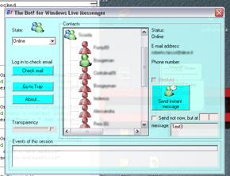

<div align="center">

## The Bot\! For Windows Live Messenger 8\.0


</div>

### Description

This program is the first bot for Windows Live Messenger 8.0. It can send instant messages (also at specific time), change status, show some information about contacts. It also shows pop-up when an event (a contact change status, nickname, etc..)occurs. I'm trying to sort contacts by group, but this doesn't work very well. Please vote! :-)
 
### More Info
 


<span>             |<span>
---                |---
**Submitted On**   |2006-07-25 22:53:30
**By**             |[Gabriele Martino](https://github.com/Planet-Source-Code/PSCIndex/blob/master/ByAuthor/gabriele-martino.md)
**Level**          |Intermediate
**User Rating**    |4.0 (20 globes from 5 users)
**Compatibility**  |VB 6\.0
**Category**       |[Internet/ HTML](https://github.com/Planet-Source-Code/PSCIndex/blob/master/ByCategory/internet-html__1-34.md)
**World**          |[Visual Basic](https://github.com/Planet-Source-Code/PSCIndex/blob/master/ByWorld/visual-basic.md)
**Archive File**   |[The\_Bot\!\_F2009067272006\.zip](https://github.com/Planet-Source-Code/gabriele-martino-the-bot-for-windows-live-messenger-8-0__1-66095/archive/master.zip)

### API Declarations

```
'Remember to set Messenger Librarys and Messenger dlls in the references (i've already done it but...), without them the program won't work.
Public Declare Function EnableWindow Lib "user32" (ByVal hwnd As Long, ByVal fEnable As Long) As Long
Public Declare Function FindWindow Lib "user32" Alias "FindWindowA" (ByVal lpClassName As String, ByVal lpWindowName As String) As Long
Public Declare Function FindWindowEx Lib "user32" Alias "FindWindowExA" (ByVal hWnd1 As Long, ByVal hWnd2 As Long, ByVal lpsz1 As String, ByVal lpsz2 As String) As Long
Public Declare Function GetWindow Lib "user32" (ByVal hwnd As Long, ByVal wCmd As Long) As Long
Public Declare Function PostMessage Lib "user32" Alias "PostMessageA" (ByVal hwnd As Long, ByVal wMsg As Long, ByVal wParam As Long, ByVal lParam As Long) As Long
Public Declare Function SendMessageLong&amp; Lib "user32" Alias "SendMessageA" (ByVal hwnd As Long, ByVal wMsg As Long, ByVal wParam As Long, ByVal lParam As Long)
Public Declare Function SendMessageByString Lib "user32" Alias "SendMessageA" (ByVal hwnd As Long, ByVal wMsg As Long, ByVal wParam As Long, ByVal lParam As String) As Long
Public Declare Function ShowWindow Lib "user32" (ByVal hwnd As Long, ByVal nCmdShow As Long) As Long
Private Declare Function SetLayeredWindowAttributes Lib "user32" (ByVal hwnd As Long, ByVal crKey As Long, ByVal bAlpha As Byte, ByVal dwFlags As Long) As Long
Private Declare Function UpdateLayeredWindow Lib "user32" (ByVal hwnd As Long, ByVal hdcDst As Long, pptDst As Any, psize As Any, ByVal hDCSrc As Long, pptSrc As Any, crKey As Long, ByVal pblend As Long, ByVal dwFlags As Long) As Long
Private Declare Function GetWindowLong Lib "user32" Alias "GetWindowLongA" (ByVal hwnd As Long, ByVal nIndex As Long) As Long
Private Declare Function SetWindowLong Lib "user32" Alias "SetWindowLongA" (ByVal hwnd As Long, ByVal nIndex As Long, ByVal dwNewLong As Long) As Long
   Public Declare Function SetForegroundWindow Lib "user32" _
   (ByVal hwnd As Long) As Long
   Public Declare Function Shell_NotifyIcon Lib "shell32" _
   Alias "Shell_NotifyIconA" _
   (ByVal dwMessage As Long, pnid As NOTIFYICONDATA) As Boolean
```


